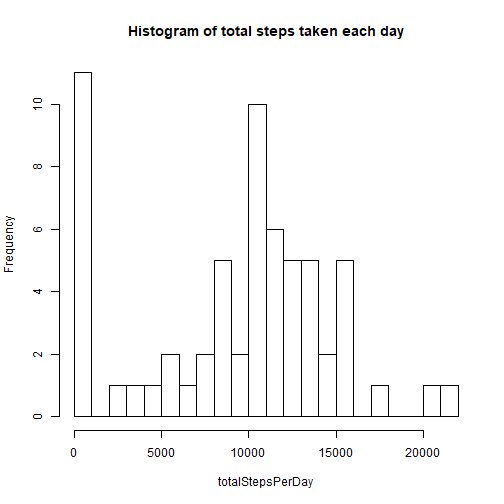

### Initialize

```r
setwd("D:/_BACKUP/R_work/Coursera/RepData_PeerAssessment1")
library(dplyr)
library(lattice)
```

### Read data

```r
d1 <- read.csv(unz("repdata_data_activity.zip", "activity.csv"), na.strings = "NA", stringsAsFactors = FALSE)
# Add a convenient new POSIXct variable 'datetime'
d1 <- d1 %>% mutate(datetime=paste(d1$date,sprintf("%04d", d1$interval),sep=" ")) %>%
      mutate(datetime=as.POSIXct(strptime(datetime, "%Y-%m-%d %H%M")))
```

### Total number of steps taken each day

```r
d2 <- d1 %>% mutate(datetime=cut(datetime, "day")) %>% group_by(datetime)
d2_total <- d2 %>% summarize(totalStepsPerDay=sum(steps, na.rm=TRUE))
```

### Histogram of the total number of steps taken each day

```r
with(d2_total, hist(totalStepsPerDay, breaks=30, main="Histogram of total steps taken each day"))
```



### Calculate and report the mean and median of the total number of steps taken per day

```r
summary(d2_total$totalStepsPerDay)
```

```
##    Min. 1st Qu.  Median    Mean 3rd Qu.    Max. 
##       0    5775   10350    9203   12868   21194
```

### Time series plot of the 5-minute interval (x-axis) and the average number of steps taken, averaged across all days (y-axis)

```r
d3 <- d1 %>% group_by(interval)
d3_total <- d3 %>% summarize(meanStepsPerIntervalPerDay=mean(steps, na.rm=TRUE))
with(d3_total, plot(interval, meanStepsPerIntervalPerDay, type="l"))
```


### The 5-minute interval that, on average, contains the maximum number of steps

```r
intervalMaxSteps <- d3_total[which.max(d3_total$meanStepsPerIntervalPerDay),"interval"]
intervalMaxSteps[[1]]
```

```
## [1] 835
```

## Code to describe and show a strategy for imputing missing data
### 1. Calculate and report the total number of missing values in the dataset (i.e. the total number of rows with NAs)

```r
sum(is.na(d1$steps))
```

```
## [1] 2304
```

```r
mean(is.na(d1$steps))
```

```
## [1] 0.1311475
```

```r
# around 13% missing values
```

### 2. Devise a strategy for filling in all of the missing values in the dataset.
### The strategy does not need to be sophisticated. For example, you could use the mean/median for that day, or the mean for that 5-minute interval, etc.

```r
steps2Imp <- d1 %>% group_by(interval) %>% summarize(stepsImp=mean(steps, na.rm=TRUE))
stepsImp <- rep(steps2Imp$stepsImp, 61)
```

### 3. Create a new dataset that is equal to the original dataset but with the missing data filled in.

```r
d1_imp <- d1 %>% mutate(steps = ifelse(is.na(steps), stepsImp[is.na(steps)], steps))
```

### 4. Make a histogram of the total number of steps taken each day

```r
d2_imp <- d1_imp %>% mutate(datetime=cut(datetime, "day")) %>% group_by(datetime)
d2_imptotal <- d2_imp %>% summarize(totalStepsPerDay=sum(steps, na.rm=TRUE))
par(mfrow=c(1,2))
with(d2_total, hist(totalStepsPerDay, breaks=30, main="Before imputation"))
with(d2_imptotal, hist(totalStepsPerDay, breaks=30, main="After imputation"))
```


### and report the mean and median total number of steps taken per day

```r
summary(d2_total$totalStepsPerDay)
```

```
##    Min. 1st Qu.  Median    Mean 3rd Qu.    Max. 
##       0    5775   10350    9203   12868   21194
```

### Do these values differ from the estimates from the first part of the assignment?

```
## Both the mean and median increased with imputation
```

### What is the impact of imputing missing data on the estimates of the total daily number of steps?

```r
summary(d2_total$totalStepsPerDay)
```

```
##    Min. 1st Qu.  Median    Mean 3rd Qu.    Max. 
##       0    5775   10350    9203   12868   21194
```

```r
summary(d2_imptotal$totalStepsPerDay)
```

```
##     Min.  1st Qu.   Median     Mean  3rd Qu.     Max. 
##    22.07  9143.25 10744.11 10592.54 12868.00 21194.00
```

## Are there differences in activity patterns between weekdays and weekends?
### 1. Use the dataset with the filled-in missing values for this part.

```r
Sys.setlocale("LC_TIME","English_United States.1252") # may be convenient
d1_imp$wday <- as.factor(ifelse(weekdays(d1_imp$datetime) %in% c("Saturday", "Sunday"), "weekend", "weekday"))
```

### 2. Time series plot of the 5-minute interval (x-axis) and the average number of steps taken, averaged across all weekday days or weekend days (y-axis)

```r
d3_imp <- d1_imp %>% group_by(interval, wday)
d3_imptotal <- d3_imp %>% summarize(meanStepsPerIntervalPerDay=mean(steps, na.rm=TRUE))
with(d3_imptotal, xyplot(meanStepsPerIntervalPerDay~interval|wday, type="l", layout=c(1,2)))
```


